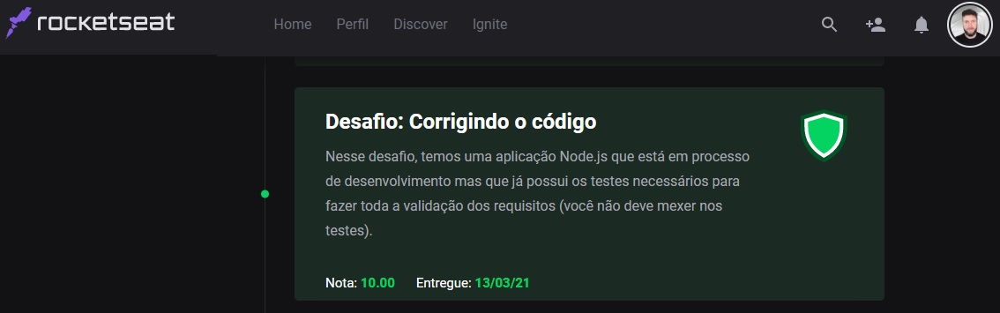

# 🔥 Ignite - Trilha NodeJS

<h3 align="center">
  Desafio 03: Corrigindo o código
</h3>


## :rocket: Sobre o desafio

Nesse desafio, temos uma aplicação Node.js que está em processo de desenvolvimento mas que já possui os testes necessários para fazer toda a validação dos requisitos (você não deve mexer nos testes).
Após algumas alterações no código da aplicação, parte dos testes deixaram de passar e agora só você pode resolver esse problema. Bora lá? 🚀

### :keyboard: Instalação e Execução do Projeto

- Clone este repositório

```
> git clone {url-do-repositorio}
```

- Navegue até o diretório principal do projeto

```
> cd ignite-trabalhando-com-middlewares
```

- Instale as dependências com o Yarn

```
yarn
```

- Rode a suite de testes

```
yarn test
```

- Execute o projeto

```
yarn dev
```

## :eyeglasses: Instruções sobre o que deve ser feito

Existe uma documentação no Notion, clique **[aqui](https://www.notion.so/Desafio-03-Corrigindo-o-c-digo-c15c8a2e212846039a367cc7b763c6dd)** para acessar!

## :memo: Licença

Esse projeto está sob a licença MIT. Veja o arquivo [LICENSE](https://github.com/git/git-scm.com/blob/master/MIT-LICENSE.txt) para mais detalhes.